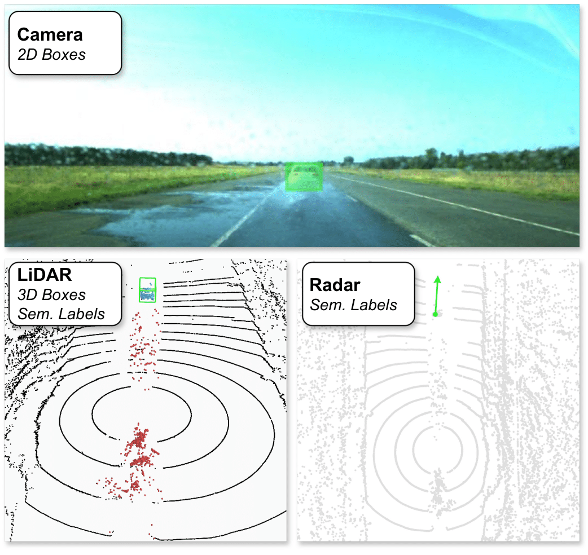
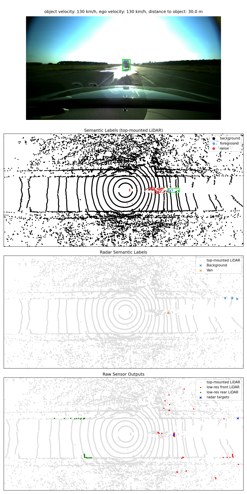
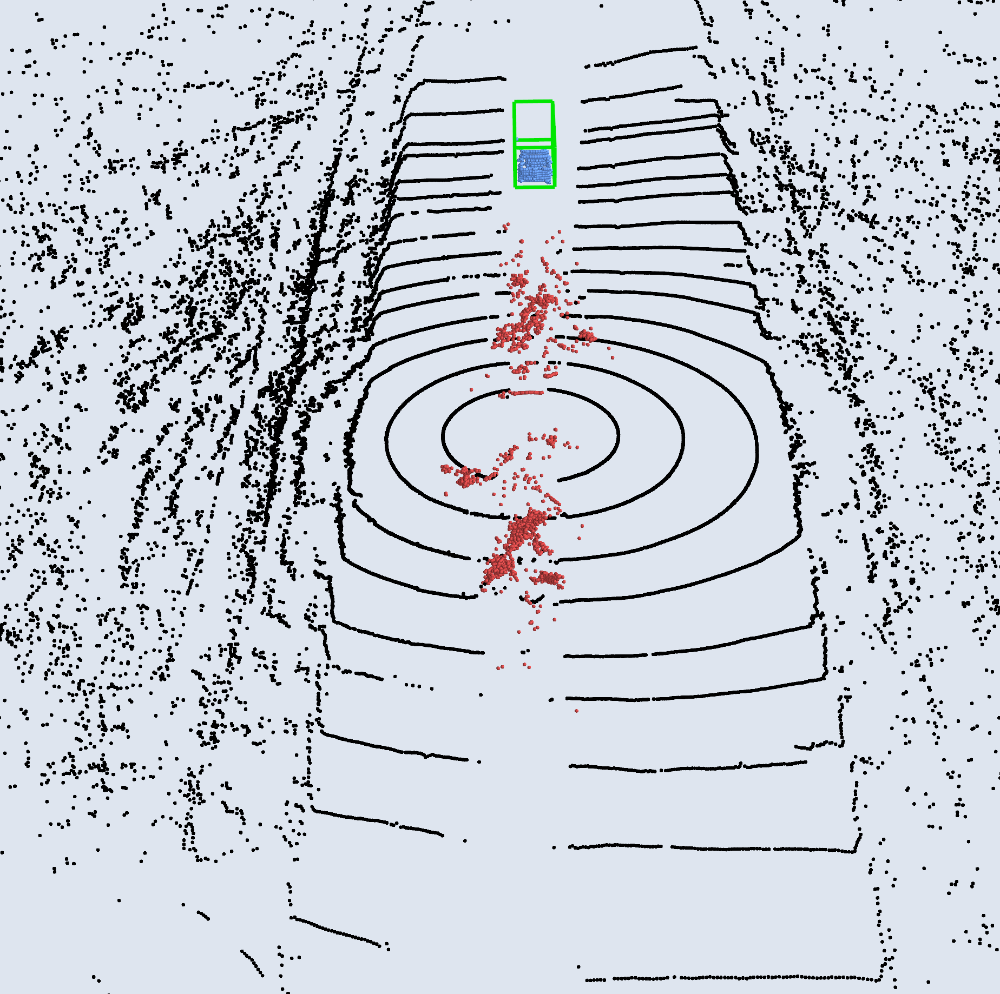
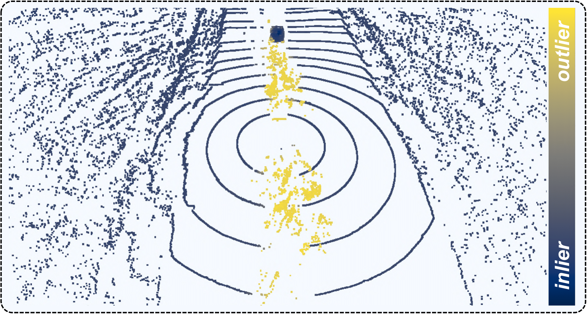

<div align="center">   

# SemanticSpray Dataset

<a href="https://replicate.com/camenduru/instantmesh"></a>
<a href="https://replicate.com/camenduru/instantmesh"></a>
<a href="https://replicate.com/camenduru/instantmesh"></a>


<a href="https://arxiv.org/abs/2305.16129"></a> 
<a href=""></a> 

</div>

|    |    |    |
|---|---|---|


<!-- <div align="center">
<figure class="half">
      
      
    
</figure>
</div> -->

## News
- **2024-04-21**: The SemanticSpray++ dataset is accepted at IV2024. Here 2D camera boxes, 3D LiDAR boxes and radar semantic labels are additionally provided.

- **2023-07-01**: The SematnicSpray dataset is released as part of our <a href="https://arxiv.org/abs/2305.16129">RA-L / ICRA-2024 paper</a>, providing for the LiDAR point cloud.

## TL;DR
The SemanticSpray dataset contains scenes in wet surface conditions captured by Camera, LiDAR, and Radar. 

The following label types are provided: 
- **Camera**: `2D Boxes`
- **LiDAR**: `3D Boxes`, `Semantic Labels`
- **Radar**: `Semantic Labels`


<div align="center">
<figure class="half">
      
</figure>
</div>


<!-- ## Abstract
<p style="text-align:justify;">
Autonomous vehicles rely on camera, LiDAR, and radar sensors to navigate the environment. 
Adverse weather conditions like snow, rain, and fog are known to be problematic for both camera and LiDAR-based perception systems.  
Currently, it is difficult to evaluate the performance of these methods due to the lack of publicly available datasets containing multimodal labeled data. 

To address this limitation, we propose the SemanticSpray++ dataset, which provides labels for camera, LiDAR, and radar data of highway-like scenarios in wet surface conditions.
In particular, we provide 2D bounding boxes for the camera image, 3D bounding boxes for the LiDAR point cloud, and semantic labels for the radar targets.
By labeling all three sensor modalities, the SemanticSpray++ dataset offers a comprehensive test bed for analyzing the performance of different perception methods when vehicles travel on wet surface conditions. 
</p>
 -->


___
## Getting Started
An automatic download script is provided:
```bash
git clone https://github.com/uulm-mrm/semantic_spray_dataset.git
bash download.sh
```
For the manual download of the data, a guide is also provided [here](docs/manual_download.md).

## Exploring The Data
 The sensor setup used for the recordings is the [following](https://www.fzd-datasets.de/spray/):
#### Sensors
  - 1 Front Camera
  - 1 Velodyne VLP32C LiDAR (top-mounted high-resolution LiDAR)
  - 2 Ibeo LUX 2010 LiDAR (front and rear mounted, l.- w-resolution LiDAR)
  - 1 Aptiv ESR 2.5 Radar

#### Raw Data
  - [Camera Image] in the folder "image_2"
  - [VLP32C LiDAR] in the folder "velodyne"
  - [VLIbeo LUX 2010 LiDAR front] in the folder "ibeo_front"
  - [VLIbeo LUX 2010 LiDAR rear] in the folder "ibeo_rear"
  - [Aptiv ESR 2.5 Radar] in the folder "delphi_radar"
#### Labels
  - [Semantic Labels for VLP32C LiDAR] in the folder "labels"
  - [Semantic Labels for Radar] in the folder "radar_labels"
  - [3D Object Labels for VLP32C LiDAR] in the folder "object_labels/lidar"
  - [2D Object Labels for Camera] in the folder "object_labels/camera"
#### Misc
  - The ego vehicle poses are located in the file "poses.txt". The convention used by the [SemanticKITTI dataset](http://www.semantic-kitti.org/dataset.html) is followed.
  - Additional information on the scene setup (e.g., ego_velocity) are given in the "metadata.txt" file.

___
## Visualizing The Data
- First create a [conda](https://docs.conda.io/en/latest/miniconda.html) envirement and install the requirements:
  ```bash
  conda create -n vis python=3.8
  conda activate vis
  pip3 install -r requirements.txt
  ```
- To visualize the data in a 2D plot, use:
  ```bash
  python3 demo.py --data data/SemanticSprayDataset/ --plot 2D
  ```
  <div align="center">
      
  </div>

- To visualize the data in a 3D plot, use:
  ```bash
  python3 demo.py --data data/SemanticSprayDataset/ --plot 3D
  ```
  <div align="center">
      
 </div>


___

## Related Work
Together with the SemanticSpray dataset, we released our paper <a
href="https://arxiv.org/abs/2305.16129"> Energy-based Detection of Adverse Weather Effects in LiDAR
Data</a> (RA-L 2023). Our method can robustly detect adverse weather conditions like rain spray, rainfall, snow, and fog in LiDAR point clouds.
Additionally, it achieves state-of-the-art results in the detection of weather effects unseen during
training.
<br>
For more information visit:
<a href="https://aldipiroli.github.io/projects/energy-based-adverse-weather-detection-lidar/index.html">Project
Page</a> / <a href="https://arxiv.org/abs/2305.16129"> Arxiv </a> / <a
href="https://www.youtube.com/watch?v=pCS3zABdaAU&embeds_referring_euri=https%3A%2F%2Faldipiroli.github.io%2F&source_ve_path=MjM4NTE&feature=emb_title">
Video</a>
<div align="center">
    
</div>


___
## Citation 
If you find this dataset useful in your research, consider citing our work:


```
@article{10143263,
  author  = {Piroli, Aldi and Dallabetta, Vinzenz and Kopp, Johannes and Walessa, Marc and Meissner, Daniel and Dietmayer, Klaus},
  journal = {IEEE Robotics and Automation Letters},
  title   = {Energy-Based Detection of Adverse Weather Effects in LiDAR Data},
  year    = {2023},
  volume  = {8},
  number  = {7},
  pages   = {4322-4329},
  doi     = {10.1109/LRA.2023.3282382}
}
```

Additionally, consider citing the original Road Spray dataset: 

```
@misc{https://tudatalib.ulb.tu-darmstadt.de/handle/tudatalib/3537,
  url       = { https://tudatalib.ulb.tu-darmstadt.de/handle/tudatalib/3537 },
  author    = { Linnhoff, Clemens and Elster, Lukas and Rosenberger, Philipp and Winner, Hermann },
  doi       = { 10.48328/tudatalib-930 },
  keywords  = { Automated Driving, Lidar, Radar, Spray, Weather, Perception, Simulation, 407-04 Verkehrs- und Transportsysteme, Intelligenter und automatisierter Verkehr, 380 },
  publisher = { Technical University of Darmstadt },
  year      = { 2022-04 },
  copyright = { Creative Commons Attribution 4.0 },
  title     = { Road Spray in Lidar and Radar Data for Individual Moving Objects }
}
```
